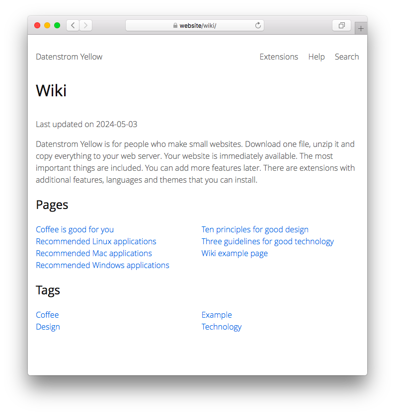

<a href="README-de.md">Deutsch</a> &nbsp; <a href="README.md">English</a> &nbsp; <a href="README-sv.md">Svenska</a>

# Wiki 0.8.30

Wiki für deine Webseite.

## Wie man eine Erweiterung installiert

[ZIP-Datei herunterladen](https://github.com/annaesvensson/yellow-wiki/archive/refs/heads/main.zip) und in dein `system/extensions`-Verzeichnis kopieren. [Weitere Informationen zu Erweiterungen](https://github.com/annaesvensson/yellow-update/tree/main/README-de.md).

## Wie man ein Wiki benutzt

Das Wiki ist auf deiner Webseite vorhanden als `http://website/wiki/`. Um eine neue Wikiseite hinzuzufügen, erstelle eine neue Datei im Wikiverzeichnis. Ganz oben auf einer Seite kannst du `Title` und andere [Seiteneinstellungen](https://github.com/annaesvensson/yellow-core/tree/main/README-de.md#einstellungen-seite) festlegen. Mit `Tag` kann man ähnliche Seiten gruppieren. 

## Wie man ein Wiki bearbeitet

Falls du Wikiseiten im [Webbrowser](https://github.com/annaesvensson/yellow-edit/tree/main/README-de.md) bearbeiten möchtest, kannst du das auf deiner Webseite machen unter `http://website/edit/wiki/`. Falls du Wikiseiten auf deinem [Computer](https://github.com/annaesvensson/yellow-core/tree/main/README-de.md) bearbeiten möchtest, schau dir das `content/2-wiki`-Verzeichnis an. Hier sind ein paar Tipps. Ganz oben auf einer Seite kannst du `Title` und andere [Seiteneinstellungen](https://github.com/annaesvensson/yellow-core/tree/main/README-de.md#einstellungen-seite) ändern. Darunter kannst du Text und Bilder ändern. [Weitere Informationen zu Textformatierung](https://datenstrom.se/de/yellow/help/how-to-change-the-content).

## Wie man Wikiinformationen anzeigt

Du kannst Abkürzungen verwenden, um Informationen über das Wiki anzuzeigen:

`[wikiauthors]` für eine Liste der Autoren  
`[wikitags]` für eine Liste der Tags  
`[wikipages]` für eine Liste von Seiten, alphabetische Reihenfolge  

Die folgenden Argumente sind verfügbar:

`StartLocation` = Ort der Wikistartseite, `auto` für automatische Erkennung  
`ShortcutEntries` = Anzahl der Einträge pro Abkürzung, 0 für unbegrenzt  
`FilterTag` = Seiten mit bestimmten Tag anzeigen, nur bei `[wikipages]`  

## Beispiele

Inhaltsdatei fürs Wiki:

    ---
    Title: Wiki-Beispielseite
    Layout: wiki
    Tag: Beispiel
    ---
    Das ist eine Beispielseite.

    Lorem ipsum dolor sit amet, consectetur adipisicing elit, sed do eiusmod tempor incididunt ut 
    labore et dolore magna pizza. Ut enim ad minim veniam, quis nostrud exercitation ullamco laboris 
    nisi ut aliquip ex ea commodo consequat. Duis aute irure dolor in reprehenderit in voluptate velit 
    esse cillum dolore eu fugiat nulla pariatur. Excepteur sint occaecat cupidatat non proident, sunt 
    in culpa qui officia deserunt mollit anim id est laborum.

Inhaltsdatei fürs Wiki:

    ---
    Title: Kaffee ist gut für dich
    Layout: wiki
    Tag: Beispiel, Kaffee
    ---
    Kaffee ist ein Getränk aus gerösteten Bohnen der Kaffeepflanze.
    
    1. Verwende frischen Kaffee. Kaffeebohnen fangen nach dem Rösten und Mahlen 
       sofort an, an Qualität zu verlieren. Den besten Kaffee erhält man, wenn 
       man die frisch gemahlenen Bohnen sofort weiterverarbeitet.
    2. Eine Tasse Kaffee zubereiten. Kaffee kann durch vielerlei Methoden und mit 
       verschiedenen Zusätzen wie Milch und Zucker zubereitet werden. Es gibt 
       Espresso, Filterkaffee, Kaffee aus der französischen Presse, Italienischer 
       Mokka, Türkischen Kaffee und vieles mehr. Finde deinen Lieblingsgeschmack.
    3. Genieße.

Inhaltsdatei mit Wikiinformationen:

    ---
    Title: Übersicht
    ---
    ## Seiten

    [wikipages]

    ## Tags

    [wikitags]

Liste mit Seiten anzeigen, unterschiedliche Anzahl Einträge:

    [wikipages /wiki/ 0]
    [wikipages /wiki/ 3]
    [wikipages /wiki/ 10]

Liste mit Seiten anzeigen, mit einem bestimmten Tag:

    [wikipages /wiki/ 0 Kaffee]
    [wikipages /wiki/ 0 Milch]
    [wikipages /wiki/ 0 Beispiel]

Links zum Wiki anzeigen:

    [Siehe alle Seiten](/wiki/special:pages/)
    [Siehe letzte Änderungen](/wiki/special:changes/)
    [Siehe Seiten von Datenstrom](/wiki/author:datenstrom/)
    [Siehe Seiten über Kaffee](/wiki/tag:kaffee/)
    [Siehe Seiten mit Beispielen](/wiki/tag:beispiel/)

Wikiadresse in den Einstellungen festlegen, URL wird automatisch erkannt:

    WikiStartLocation: auto
    WikiNewLocation: @title

Wikiadresse in den Einstellungen festlegen, URL mit Unterverzeichnis für Autor:

    WikiStartLocation: /wiki/
    WikiNewLocation: /wiki/@author/@title

Wikiadresse in den Einstellungen festlegen, URL mit Unterverzeichnis zur Kategorisierung:

    WikiStartLocation: /wiki/
    WikiNewLocation: /wiki/@tag/@title

## Einstellungen

Die folgenden Einstellungen können in der Datei `system/extensions/yellow-system.ini` vorgenommen werden:

`WikiStartLocation` = Ort der Wikistartseite, `auto` für automatische Erkennung  
`WikiNewLocation` = Ort für neue Wikiseiten, [unterstützte Platzhalter](#einstellungen-placeholders)  
`WikiShortcutEntries` = Anzahl der Einträge pro Abkürzung, 0 für unbegrenzt  
`WikiPaginationLimit` = Anzahl der Einträge pro Seite, 0 für unbegrenzt  

Die folgenden Platzhalter für neue Wikiseiten werden unterstützt:

`@title` = Seitentitel  
`@author` = Autor der Seite  
`@tag` = Tag zur Kategorisierung der Seite  

Die folgenden Dateien können angepasst werden:

`content/shared/page-new-wiki.md` = Inhaltsdatei für neue Wikiseite  
`system/layouts/wiki.html` = Layoutdatei für individuelle Wikiseite  
`system/layouts/wiki-start.html` = Layoutdatei für die Wikistartseite  

## Entwickler

Anna Svensson. [Hilfe finden](https://datenstrom.se/de/yellow/help/).
